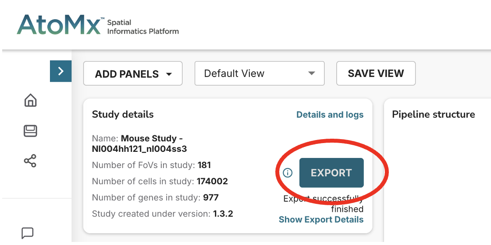
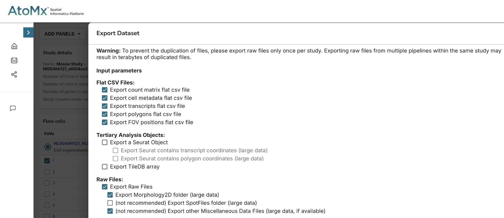
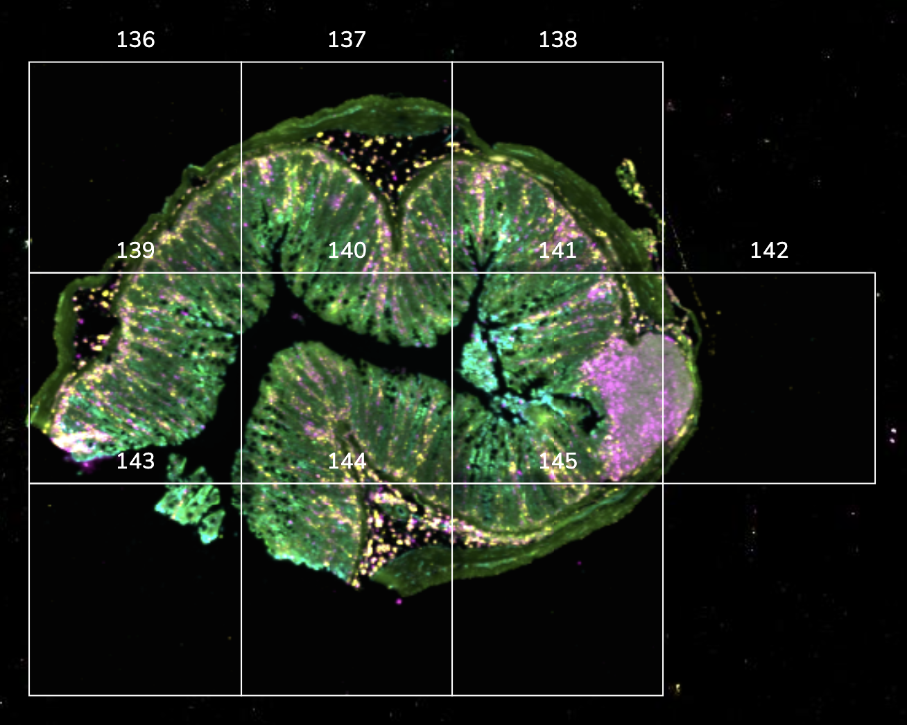
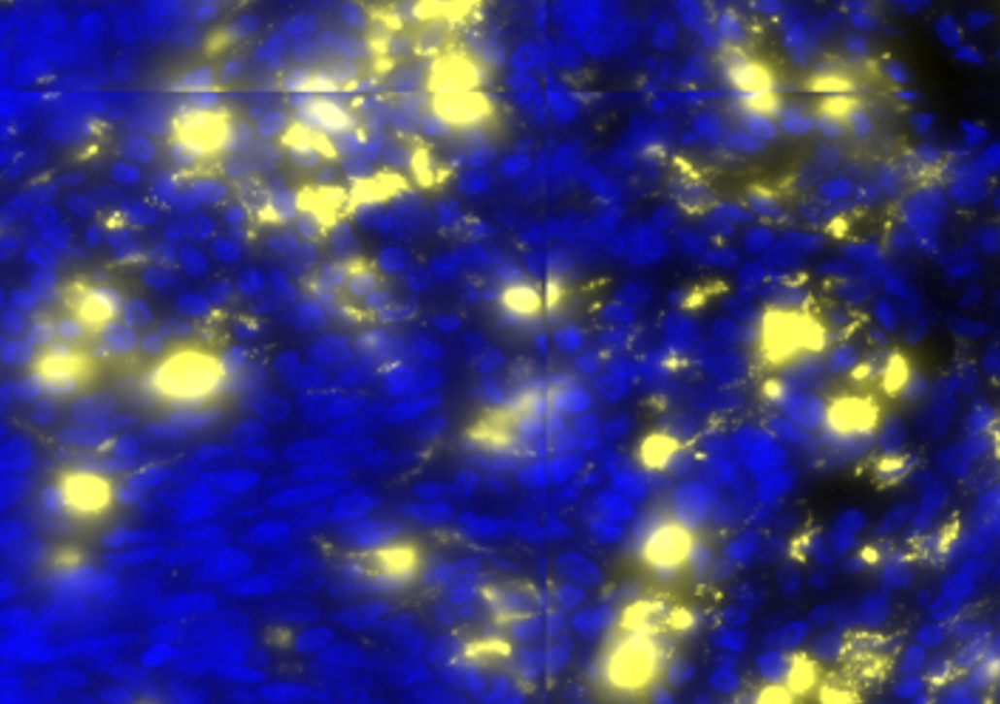

# CosMx mouse gut analysis workflow - Part 1

The following markdown provides a step-by-step workflow to reproduce the analysis of a CosMx study of the mouse gut in an IBD model, **from retrieving the raw data to generating one 'master' `SpatialData` object containing a stitched image and transcripts table per sample on the original microscopy slide**. (See Part 2 for the next steps of the analysis.)

* * *

## Study overview

The experiment covers . . .

### Data storage on BMRC

Raw and processsed data alongside key scripts to reproduce the analysis on the BMRC cluster in this directory: `/users/sansom/tme871/work/cosmx_mouse`

Here is an overview of where to find key files:

- Original raw data, as exported from `AtoMx SIP` through their user interface: `/users/sansom/tme871/work/cosmx_mouse/data/raw/atomx`

> [!NOTE]
> At this stage of the analysis (June 2025), we are confidently moving away from `AtoMx` default analyses tools, so these data files could be deleted (knowing they can always be downloaded again from our `AtoMx SIP`). I have kept them as an example of an `AtoMx` export, but the minimal relevant files are copied in the directories described in the bullet point below.

- **Raw data, re-organized for analysis with `spatialhub`**: `/users/sansom/tme871/work/cosmx_mouse/data/raw/${SLIDE_ID}`, with the following slide IDs available: NL4S3a, NL4S3b, NL5H1a, NL5H1b ('a' indicates a KIR run, 'b' indicates a CAMS run - see experimental design section above)
- **Metadata**, including `spatialhub` samples.tsv table (full and filtered for samples passing QC, see details below) and lists of CosMx probes (standard 'LBL-11176-05-Mouse-Universal-Cell-Characterization-Gene-List.txt' and custom add-on panel '1K_Oxford_Sansom_add-on_list.csv')

> [!WARNING]
> **In this study, some of the custom probes use special characters (e.g. *SiglecF (170)* instead of *Siglecf*) and/or non-conventional gene symbols (e.g. *Ly6G* instead of *Ly6g*; *Cd64* instead of *Fcgr1*). In addition, some probes in the standard panel are cross-reactive and match multiple genes. Whenever comparing a CosMx probe panel to reference scRNA-seq datasets/pathway libraries/etc., it is essential to ensure that gene names are properly encoded for the intended purpose.** This point is highlighted again where most relevant in the workflow description.

- **IBD_mouse_scRNA-seq_atlas**: Directory (and [GitHub repo](https://github.com/sansomlab/IBD_mouse_scRNA-seq_atlas)) collecting data and scripts used to generate a scRNA-seq atlas fit for the purpose of annotating this specific CosMx dataset.
- **spatialhub**: Main analysis folder, containing YAML, log out output files/directories from steps run with the `spatialhub` pipeline, as well as additional scripts for steps requiring more customization.
- Other directories contain pilot scripts (irrelevant to reproduce the final analysis), used to test different spatial transcriptomics tools before rolling them out to the dataset as a whole and/or adding them to the `spatialhub` suite of pipelines, if applicable

* * *


## Step 1: Retrieve raw data from `AtoMx`

Once a `CosMx` run is complete, a new microscopy slide will appear on the `AtoMx SIP` user interface. You'll first need to create a study for the slide(s) of interest. 

Once a study has been created, open it and click on 'EXPORT' (top left area of the screen, under the 'Study details' section) to retrieve the data:

<p align="center">
    
</p>

Select all of the following files in the pop-up window that opens:

<p align="center">
    
</p>

This pop-up window also states the SFTP information to use to access the data once the export is complete. For Kennedy users, you can use the following command and navigate to the directory of interest to copy the data to the BMRC:

```
sftp -P 22 username@kennedy.ox.ac.uk@eu.export.atomx.nanostring.eu
```

OPTIONAL: To make the raw data accessible to other members in your user group, update the read and execute rights for directories and files using `chmod -R a+rX *` (executed within your raw data directory).


> [!NOTE]
> **Please refer to the latest [NanoString University documentation](https://university.nanostring.com/) for further details on how to use the `CosMx` suite of software, and especially [this manual](https://university.nanostring.com/cosmx-smi-data-analysis-user-manual).**

* * *


## Step 2: Re-organize raw data for analysis with `spatialhub`

The raw data export from `AtoMx` includes multiple superfluous files, and a nested directory structure that can make relevant information difficult to find. To streamline analysis with `spatialhub`, we thus first (manually) re-organize our raw data directory such that there is **one sub-directory per microscopy slide** run on the CosMx machine (regardless of other potential batch effects, e.g. different runs with multiple slides each). **Each slide-specific directory must have the same name as listed in the 'slide_id' column of the `spatialhub` samples.tsv file** (see below for details on how to specify this file).

In each slide's directory, copy the following sub-directories and files, using the following name conventions:

- **ESSENTIAL**: `flatFiles` = copy of the `flatFiles` folder from the `AtoMx` export (the original name key can be modified, but the original '_exprMat_file.csv.gz', '_metadata_file.csv.gz' file names must be kept)
- **ESSENTIAL**: `Morphology2D` = copy of '20241018_210447_S1_C902_P99_N99_F00*XYZ*.TIF' microscopy image files from the the `AtoMx` export, found under `RawFiles/*/CellStatsDir/Morphology2D` (do not rename!!)
- **OPTIONAL** (recommended, especially for a first-pass QC/analysis while working on fine-tuning the segmentation mask): `atomx_segmentation` = copy of 'CellBoundaries_F00*XYZ*.csv' segmentation mask files (do not rename!!) from the `AtoMx` export, found under each FOV's sub-directory in `RawFiles/*/CellStatsDir/` (do not rename!!)
- **OPTIONAL** (missing these files won't break the pipeline, but it is strongly recommended to have a copy of them handy for future reference):
    - 'Morphology_ChannelID_Dictionary.txt': necessary to match each microscopy channel to its corresponding marker (useful to specify in ashlar YAML file)
    - 'Run_*RunSpecificKey*_ExptConfig.txt': necessary to know the pixel to micron conversion factor
    - both of these files are found under `RawFiles/*/RunSummary` in the original `AtoMx` export

* * *


### Step 3: Create a `spatialhub` samples.tsv file

[This metadata file](./files/mouse_ibd_hh_spatialhub_samples.tsv) is essential to run and parallelize jobs in the `spatialhub` pipeline. 

The following fields are mandatory (the order they appear in does not matter):

- **slide_id**: This is the short name given to the microscopy slide run on the CosMx device. It must match exactly the name of the correspoding slide's sub-directory in your re-organized raw data main directory
- **sample_id**: Unique ID for one sample on each microscopy slide. This must be unique within each slide; however, if replicates are found on different slides, they can have the same ID
- **fov_sequence**: List of comma-separated FOV numbers (without space) for the FOVs that cover this sample from top left to bottom right (use the `AtoMx SIP` to visualize the slide and gather this information). This sequence will notably be used for stitching with the ashlar pipeline, which requires a complete FOV grid, i.e. forming a complete rectangular shape without empty space in the middle. Therefore, the fov_sequence for the example image below must be recorded as "136,137,138,blank,139,140,141,142,143,144,145,blank" (use 'blank' for any missing FOV)
- **fov_width**: number of FOVs spanning the image width (4 in the example image below)
- **fov_height**: number of FOVs spanning the image height (3 in the example image below)

<p align="center">
    
</p>


The following fields are optional, and have the following purpose:

- **sample_name**: Unique 'human-interpretable' sample ID (if not defined, this will be equal to sample_id by default). This can be useful to convert between original study identifiers (e.g. 'NL5H1b_S10' for the 10th sample on slide 'NL005HH1_NL004HH1_NL02208') and a more intuitive identifier ('D04_prox1', since this sample corresponds to a proximal colon sample from mouse sacrificed at Day 4, biological replicate #1)
- any other covariate of interest, such as donor_id, condition, batch, etc. These will be appended to any `AnnData` object derived from the pipeline.

* * *


## Step 4: Run initial QC

> [!TIP]
> **From here onwards, it is recommended to run all steps within a dedicated `spatialhub` directory.**

This first round of QC relies on the default `AtoMx` segmentation mask. Of note, even if not planning to use this segmentation mask for downstream analyses, it is useful to run a first pass of QC at this point, to enable:

- FOV-level QC (optionally, using some Bruker NanoString tools)
- Identification of low-quality samples, which should be filtered out before proceeding with other resource-intensive tasks of the pipeline


### 4.1. Preparing an AnnData object

To run this probe QC pipeline, first create a combined AnnData object from raw `AtoMx` files, using the function provided in `spatialhub` adata_utils within a python session:

```
#!/usr/bin/env python3

import spatialhub.tasks.adata_utils as utils
import anndata as ad
import scanpy as sc

path2flatFiles = "/users/sansom/tme871/work/cosmx_mouse/data/raw/NL4S3a/flatFiles"
a4data = utils.adata_from_cosmx(path2flatFiles, slide_id = 'NL4S3a')

path2flatFiles = "/users/sansom/tme871/work/cosmx_mouse/data/raw/NL4S3b/flatFiles"
b4data = utils.adata_from_cosmx(path2flatFiles, slide_id = 'NL4S3b')

path2flatFiles = "/users/sansom/tme871/work/cosmx_mouse/data/raw/NL5H1a/flatFiles"
a5data = utils.adata_from_cosmx(path2flatFiles, slide_id = 'NL5H1a')

path2flatFiles = "/users/sansom/tme871/work/cosmx_mouse/data/raw/NL5H1b/flatFiles"
b5data = utils.adata_from_cosmx(path2flatFiles, slide_id = 'NL5H1b')

adata_dict = {
    'NL4S3a': a4data, 'NL4S3b': b4data,
    'NL5H1a': a5data, 'NL5H1b': b5data,
}
adata_combined = ad.concat(adata_dict, index_unique = "_")
adata_combined.write('mouse_ibd_hh_atomx.h5ad', compression = 'gzip')
```


### 4.2. Preparing the YAML file

Next, generate a YAML file for the `spatialhub` probeqc pipeline using the following on the command line:

```
spatialhub probeqc config
```

This generates a probe QC YAML file, which notably points the pipeline to the samples.tsv table and h5ad file to use for QC. 

If a custom panel was used (as is the case in this example), the user can specify which probes are custom (others will be treated as standard by default), and the number of transcripts associated to these will be computed (in contrast to the number of transcripts from standard probes).


#### Notes on FOV QC

The FOV-level QC section of the YAML file specifies whether to run Bruker's tool to check for instrument failures. [See their GitHub for details and to source their code](https://github.com/Nanostring-Biostats/CosMx-Analysis-Scratch-Space/tree/Main/_code/FOV%20QC). A copy of the exact version of the script used in this project is available on the BMRC cluster at `/users/sansom/tme871/devel/spatialhub/R/bruker_FOV_QC_utils.R`

> [!TIP]
> When running Bruker's FOV QC tool, you may find that some of the default parameters implemented in their script need to be tweaked. This is currently not implemented in the `spatialhub` probeqc pipeline, which means you'll need to manually amend the script sourced from Bruker's GitHub. Notably, the `squares_per_fov` and `min_cells_per_square` parameters in the `makeGrid` function may need adjusting for low-sensitivity CosMx dataset, as illustrated in the code chunk below.

```
# lines 32-34 - /users/sansom/tme871/devel/spatialhub/R/bruker_FOV_QC_utils.R
  gridinfo <- makeGrid(xy = xy, fov = fov, 
                       squares_per_fov = 36,  # Bruker default: 49
                       min_cells_per_square = 10) 
```

#### Notes on filtering parameters

The filtering section of the YAML file provides options to define QC thresholds at the cell-level and sample-level. 

Sample-level filters are particularly useful for studies with microscopy slides including many samples, each of which is only covered by a few FOVs (in such a scenario, one or two poor-quality FOVs may mean that >50% of the sample is of low-quality, and it may be preferable to remove this sample altogther). The user can notably set a minimum number/percent of high-quality cells remaining in the sample for it to be retained (too few cells usually means a sparse sample and biased spatial metrics in downstream analyses), as well as whether cells within low-quality FOVs should all be considered as low-quality or not when tallying the number of high-quality cells in a sample (we recommend to set this to False, as cells/FOVs with bias are usually identified independently in downstream analyses). 

> [!IMPORTANT]
> **The data will NOT be filtered by the probe QC pipeline: thresholds specified in the YAML file are only meant to flag high-quality cells/samples, with the final filtering left to the user, as it will be highly study-specific.**


### 4.3. Running the pipeline tasks and reviewing results

Next, run the pipeline using:

```
spatialhub probeqc make full -v5 -p20
```

A `probeqc.dir` directory will be generated in your run directory, including some default R markdown HTML reports if the 'compile_reports' option was set to True. **It is likely that those reports will need additional customization. Notably, use the 'probeqc_header.Rmd' to specify the contrast variables of interest in your project (`x` variable, line 11) and to refine the plotting parameters (second chunk).**

If wishing to adjust the filtering thresholds, delete the sentinel files and repeat this pipeline run. 


### 4.4. Filtering dataset for low-quality samples/cells

Once satisfied with your QC filters, perform a manual filtering (with potential additional filters) of the `spatialhub` samples.tsv table, e.g. by running this script (`/users/sansom/tme871/work/cosmx_mouse/spatialhub/filter_metadata.R`):

```
#!/usr/bin/Rscript --vanilla
  
samples_df <- read.delim("../metadata/mouse_ibd_hh_spatialhub_samples.tsv", sep = "\t")
nrow(samples_df)  # 63 samples

samples_qc <- read.csv("probeqc.dir/mouse_ibd_hh_atomx_sampleQCmetrics.csv")
meta_qc <- read.csv("probeqc.dir/mouse_ibd_hh_atomx_metadata_QC.csv")

# Exclude samples flagged by initial probeqc run as low-quality
keep_idx <- unique(samples_qc$sample_id[samples_qc$qcFlagSample_summary == "Pass"])
samples_df <- samples_df |>
    dplyr::filter(sample_id %in% keep_idx)
nrow(samples_df)  # 59 retained samples


# Check whether there remains some borderline samples
meta_qc <- meta_qc |>
    dplyr::filter(sample_id %in% keep_idx)

# No FOV-level filter was applied when running spatialhub probqc, so let's check whether this may be an issue.
# Samples for which the majority (>50%) of cells fall in a low SNR FOV
t <- table(meta_qc$sample_id, meta_qc$qcFlagFOV_SNR)
pct <- round(t[, 1]/table(meta_qc$sample_id) * 100, 1)
pct[pct > 0] |> sort()
excl_idx <- names(pct[pct > 50])
samples_df <- samples_df |>
    dplyr::filter(!(sample_id %in% excl_idx))
nrow(samples_df)  # 55 retained samples

# Samples for which the majority (>50%) of cells fall in a FOV with gene bias (?)
t <- table(meta_qc$sample_id, meta_qc$qcFlagGeneBias)
pct <- round(t[, 1]/table(meta_qc$sample_id) * 100, 1)
pct[pct > 0] |> sort()
    # highest value is 20.3% (fine!)

# Finally, are there still some samples with 'borderline' cell counts?
samples_qc <- samples_qc |>
    dplyr::filter(sample_id %in% keep_idx) |>
    dplyr::filter(!(sample_id %in% excl_idx))
samples_qc |>
    dplyr::arrange(desc(nCell_sampleSum_passQC)) |>
    tail(n = 10)
summary(samples_qc$samplePercentCellsInFailedFOV)


# Write filtered spatialhub samples file
write.table(samples_df, row.names = FALSE, quote = FALSE,
            file = "../metadata/mouse_ibd_hh_spatialhub_samples_filtered.tsv", sep = "\t")
```

Accordingly, filter the AnnData object derived from the `AtoMx` segmentation mask using this script (`/users/sansom/tme871/work/cosmx_mouse/spatialhub/filter_anndata.py`):

```
#!/usr/bin/env python3
  
import os
import anndata as ad
import scanpy as sc
import pandas as pd


# Import AnnData and post-QC metadata derived from matching segmentation mask
adata = sc.read_h5ad("anndata.dir/mouse_ibd_hh_atomx.h5ad")
metadata = pd.read_csv("probeqc.dir/mouse_ibd_hh_atomx_metadata_QC.csv")

# Match indexes
metadata.index = metadata['cell_index']
idx_order = adata.obs.index.to_list()
metadata = metadata.reindex(idx_order)

# Double-check that key overlapping columns contain equal information
s = metadata['slide_id'].equals(adata.obs['slide_id'].astype(str))
f = metadata['fov'].equals(adata.obs['fov'])
if s and f:
    metadata = metadata.drop(columns=['slide_id', 'fov', 'cell_index'])

# Further remove other overlapping columns
dupVar = list(set(metadata.columns) & set(adata.obs.columns))
metadata = metadata.drop(columns=dupVar)

# Update adata.obs
if metadata.index.equals(adata.obs.index):
    adata.obs = adata.obs.join(metadata)
    adata.obs['segmentation_mask'] = 'atomx'


# Import samples TSV table filtered for low-quality samples
samples = pd.read_csv("../metadata/mouse_ibd_hh_spatialhub_samples_filtered.tsv", sep = "\t")

# Finally, filter AnnData object to retain only high-quality cells and samples
samples_filter = adata.obs['sample_id'].isin(samples['sample_id'])
adata = adata[samples_filter]
cells_filter = adata.obs['qcFlagCell_summary'] == 'Pass'
adata = adata[cells_filter]


# For clustering and cell type annotation, we are not interested in negative/system probes
# (nor in bacterial probes)
bac_filter = adata.var.index.str.contains('Bac|Heli|bac|heli|16S')
adata.var.index[bac_filter]; adata = adata[:, ~bac_filter]
ctrl_filter = adata.var.index.str.contains('Negative|System')
adata.var.index[ctrl_filter]; adata = adata[:, ~ctrl_filter]

# In the case of this custom panel, we also need to document our CosMx probe names properly
# (i.e. correct typos/special characters in probe names)
probes_annot = pd.read_csv("../metadata/cosmx_probes_updated.csv")
probes_annot.index = probes_annot['original']
adata.var = adata.var.join(probes_annot)

# Save object ready for integration and/or global cell type annotation
adata.write_h5ad("anndata.dir/mouse_ibd_hh_atomx_filtered.h5ad")
```

* * *


## Step 5: Stitch samples using Ashlar

The Ashlar pipeline can now be used to generate one stitched image and `SpatialData` object per sample. The purpose of this pipeline is three-fold:

1. Correctly stitch FOVs from the CosMx run. This is necessayr because when 'stitching' FOVs together, the default CosMx tools merely append FOV images to each other, without taking into account the overlap between adjacent FOVs (see example image below);

<p align="center">
    
</p>

2. Split the slide into its component samples, if applicable. This will enable parallel processing of different samples for downstream tasks, as well as the creation of 'composite' microscopy slides focused on samples of interest;
3. Generate an initial `SpatialData` object (stored as a `.zarr` directory) for each sample, which will be essential for many downstream data visualization and analyses tasks. [Please review the `SpatialData` documentation for further details on this file format.](https://spatialdata.scverse.org/en/stable/)


### 5.1. Preparing the YAML file

First, generate a YAML file for the `spatialhub` ashlar pipeline using the following on the command line:

```
spatialhub ashlar config
```

This generates a Ashlar YAML file, which notably points the pipeline to the samples.tsv table and to the raw data directory, prepared as outlined in [Section 3 above](#step-3-create-a-spatialhub-samplestsv-file).

Parameters in this YAML file should apply to most CosMx runs (as of June 2025); however, it is advisable to double-check:

- the pixel to micron conversion factor (pixel_size), found in the 'Run_*RunSpecificKey*_ExptConfig.txt' file exported from `AtoMx`;
- the order of colour channels and markers they are associated with, found in the 'Morphology_ChannelID_Dictionary.txt' file exported from `AtoMx`;
- the names of the columns storing information about i) the probe name (the current default is `target` in the AtoMx transcripts '_tx_file.csv.gz' file) and ii) x/y coordinates


### 5.2. Running the pipeline tasks 

Once the YAML file is ready, the pipeline can be run with:

```
spatialhub ashlar make full -v5 -p20
```

> [!CAUTION]
> The first task in the `ashlar` pipeline involves creating a split copy of the `AtoMx` raw expression matrix and transcripts file. The purpose of this is to limit the memory needed to load the data in downstream tasks, thus leading to significant speed improvements. This task is run using a [bash script](../bash/cosmx_setup.sh), and adds a `split_exprMat` and `split_txFile` to the raw data folder. **This task will generate an incorrect output if these directories pre-exist and are not empty. Once it has been run, make sure not to remove the corresponding sentinel file(s) (`ashlar.dir/logs/[slide_id]_splitFlatFiles.sentinel`). If you wish to repeat this task, manually delete the `split_exprMat` and `split_txFile` first.**

> [!WARNING]
> For this specific project, adding the `AtoMx` segmentation mask to the `.zarr` stack triggered an error for a few of the samples. After running the command line above to generate `SpatialData` objects for most samples, we thus repeated the run with the pipeline temporarily pointing to [this version](../python/ashlar_zarr_debug.py) of the `.zarr` generation file, which filters out cells with missing coordinates from the `AtoMx` segmentation mask. **Only use this debugging script for samples that failed in first instance, otherwise it will remove valid cell masks from other segmentation masks.** In a future version of `spatialhub`, we aim to investigate this bug further and provide a more robust fix.


### 5.3. Reviewing outputs

Major outputs from this pipeline are stored in two new directories, which will be generated in your run directory: `ashlar.dir` and `zarr.dir` (if `create_zarr` was set to `True` in the YAML file).

In addition to logs for all runs, the `ashlar.dir` directory contains one sub-directory per slide (to match the structure in the input raw data directory), each containing the following:

- A `Morphology2D` directory, with symlinks to each sample's component FOV TIFF files and blank FOV TIFF files in the correct sequence, if applicable (intermediate output, necessary for [`ashlar`](https://labsyspharm.github.io/ashlar/) to run successfully);
- A `Stitched2D` directory, with one stitched TIFF image, one stitched transcripts file and one corrected FOV position file per sample. **Output in this directory may be handy for segmentation tools which do not accept `SpatialData` as input.**

The `zarr.dir` directory will become our main data storage directory, and we will keep adding elements to it as we run through the `spatialhub` pipeline. For each slide and sample, it contains a `.zarr` directory gathering all relevant information in one place (microscopy image, transcripts data table, segmentation mask(s)...). [Please review the `SpatialData` documentation for further details on this file format.](https://spatialdata.scverse.org/en/stable/)
